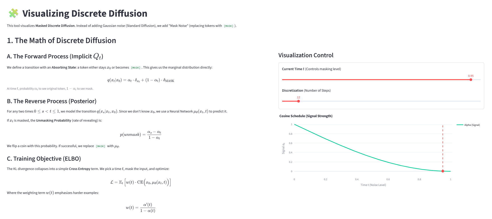
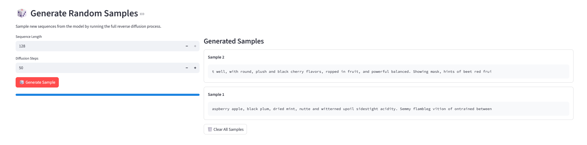
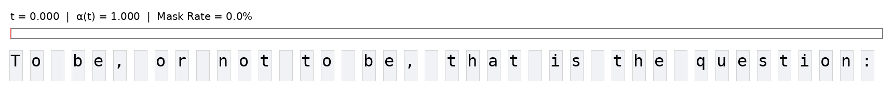
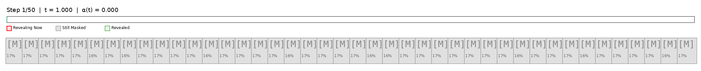

# Tiny Discrete Language Model (TDLM)

TDLM is a minimal, educational implementation of a **Masked Discrete Language Model**. It directly implements the [MD4 model by Google DeepMind](https://github.com/google-deepmind/md4) from their 2024 paper, ["Simplified and Generalized Masked Diffusion for Discrete Data"](https://arxiv.org/abs/2406.04329).
Unlike traditional autoregressive models that generate text left-to-right, this model learns to reconstruct text from a masked state in a diffusion manner, allowing for hollistic generation.

This repository is designed to be simple, hackable, and easy to understand, with a focus on visualizing the internal diffusion process.

## 🎥 Streamlit Visualization

Run this interactive visualization with 'streamlit run viz.py'.



### Sample from the trained model
You can get a sense of the model's generative capabilities and play around with temperature, number of diffusion steps, and sequence length in the streamlit app.




### The Forward & Reverse Process 
The GIFs can be directly created in the streamlit app.




## 📂 Repository Structure

- **`model.py`**: The MD4 network definition, adapted from [DeepMind's JAX implementation](https://github.com/google-deepmind/md4/blob/main/md4/models/diffusion/md4.py).
- **`transformer_impl.py`**: Implementation of a Transformer adapted from [DeepMind's implementation](https://github.com/google-deepmind/md4/blob/main/md4/networks/sharded_transformer.py).
- **`train.ipynb`**: Run this notebook to train the model on your own data (or recreate it using mine).
- **`viz.py`**: Streamlit visualization. See above.
- **`gif.py`**: Helper functions to generate the GIFs.
- **`assets/`**: Contains a pdf presentation above the topic.
- **`blobs/`**: Holds the dataset, the model weights and the optimizer states (if you want to continue training).

## 📊 Slides
You can view the presentation slides explaining the architecture & the project [here (PDF)](assets/SimplifiedMaskedDiffusion.pdf).

## 🚀 Getting Started
1. Git clone the repository.
2. Install torch and streamlit.
3. You are done.
4. (You can continue training by using the downloaded optimizer states.)

```bash
pip install torch streamlit
